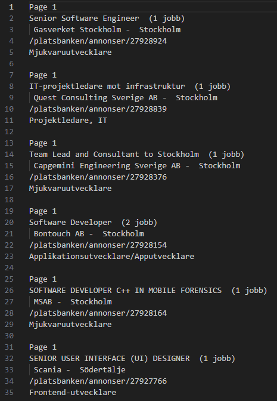

# Scrape-arbetsformedlingen-stats
[WIP] Webscape arbetsförmedlingen to get stats about current developer job market 

Plans:

    * Get email adresses
    * Sort with ChatGPT based on:
        Role
        Experience level
        Languages
        Match % - With ChatGPT
    * Auto send email with ChatGPT based on LinkedIn profile

## First version output looks like this:

### Ethical issues

TBA
